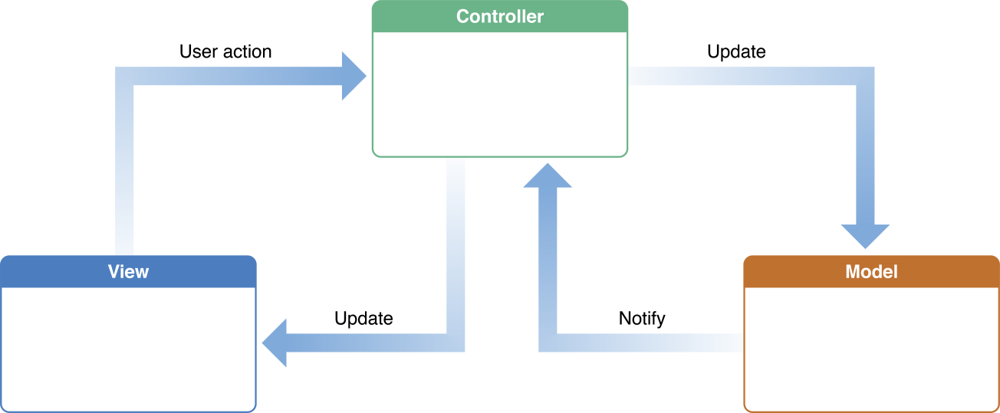

###MVC（模型﹣视图-控制器）
模型-视图-控制器（MVC）设计模式在应用程序中的分配对象三种角色：模型，视图或控制器。该模式不仅定义了应用程序中的角色，还定义了它们之间的相互通讯。这三种类型的对象，通过抽象边界划分并且通过这种边界进行通讯。一个程序中的MVC对象的集合有时候被称为层，例如：模型层。

MVC是一个Cocoa应用程序的一个好的设计的核心。采用这种模式的好处是多方面的。这些应用中这些对象大量的重用并且接口更好的定义。MVC的程序比其他的程序更容易的扩展。此外，很多Cocoa技术和架构是基于MVC并要求你自定义的对象也是扮演MVC的角色。 

####M-模型对象

模型对象封装一个程序的数据，对数据定义，逻辑运算，处理这个数据。例如：一个模型对象可能代表一个游戏中的或者地址薄中的一个字符。一个模型对象可能跟其他对象有一对一或者一对多的关系。因此，有时候模应用型层是一个或者多个对象图。数据加载到程序之后应用中大部分的数据是持久化的形式（无论是文件或者数据库的持久化）驻留在模型对象中。因为模型对象

**通讯：**用户操作在视图层上创建或者修改数据通过一个控制器对象传达并把结果创建或者更新给一个模型对象。当一个模型对象改变（例如：新的数据通过的网络接收），将会通知控制器，更新视图对象（view）！

####V-视图对象

应用程序中用户看到的就是一个视图对象。视图对象知道怎么绘制跟相应的用户交互。应用程序的主要目的是展示跟修改模型数据。尽管如此，应用程序中，视图对象是对象模型的解藕！

因为你通常重复使用和重新配置，视图对象提供应用程序之间的一致性。无论是UIKit中和了AppKit框架提供的视图类的集合，和Interface Builder提供了几十视图对象在其图书馆。

**通讯：**视图对象通过控制器对象跟用户发起的改变获取模型的数据的改变。例如：textffield键入文字通过控制器对象给模型对象。

####C-控制器对象

控制器对象担当着一个或者多个视图跟一个或者多个模型直接的中介角色。控制器是作为视图对象获取模型对象的一个渠道，反之亦然。对于应用程序控制器也可以执行设置跟协调任务并且管理管理其他对象的生命周期。

**通讯：**控制器对象解释针对对象所做的用户操作和通信，新的或更改数据模型层。当模型对象改变，控制器对象传达 ​​的新的模型数据的查看对象，以便他们可以显示它。
参考链接： 

《Model-View-Controller》<https://developer.apple.com/library/ios/documentation/General/Conceptual/DevPedia-CocoaCore/MVC.html>