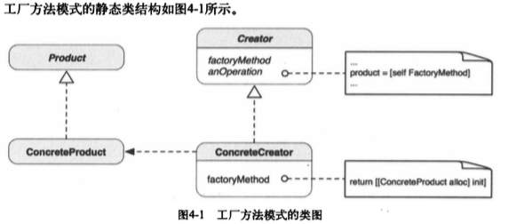

#你好设计模式


###1.5设计模式的起源----模型、视图和控制器（MVC）


MVC设计模式机器变体至少在Smalltalk诞生初期就已经出现了。这个设计模式是Cocoa Touch中很多机制和基础。

#####1.5.1模型再对象中封装数据和基本行为

#####1.5.2视图对象向用户展示信息

#####1.5.3控制器对象联系模型和视图

#####1.5.4复合设计模式的MVC

MVC本身并不是最基本的设计模式，包含了若干更加基本的模式。基本设计模式相互配合，确定了各功能之间的协作。

Cocoa（Touch）的MVC 用到的模式有：组合（Composite）、命令（Command）、中介者（Mediator）、策略（Strategy）和观察者（Observer）。

* 组合——视图对象之间以写作的方式构成一个视图层次体系，其中既可以有复合视图（比如表格视图），也可以有独立视图（比如文本框或按钮）。每个层次的每个视图节点都可以响应用户的操作并把自己绘制到屏幕上。
* 命令——这是一种“目标——动作”机制，视图对象可以推迟其他对象（比如控制器）的执行，让其他对象等到发生了某些事件后再执行。这一机制构成了命令模式。
* 中介者——控制器对象起着中间人的作用，这个中间人采用了中介模式，它构成了模型和视图对象之间传递数据的双向通道。应用程序的控制器对象将模型变更传达给视图对象。
* 策略——控制器可以是视图对象的一个“策略”。视图对象将自身隔离，以期维持其作为数据展示器的唯一职责，将一切应用程序持有的界面行为决定委派给它的“策略”对象（既控制器）
* 观察者——模型对象向它所关注的控制器等对象发出内部状态变化的通知。

###1.6 影响设计的几个问题

#####1，6.1 针对接口编程，而不是针对实现编程

定义具有相同接口的类群很重要，因为多态是基于接口的。

实现协议或者从抽象类继承，使得对象共享相同的接口。

好处：

* 只要对象对象符合客户端所要求的接口，客户端就不必在意所使用对象的确切类型；
* 客户端只知道定义接口的协议或者抽象类，因此客户端对对象的类一无所知。

客户端代码中不声明特定具体类的变量，而只使用协议或抽象类定义的接口。这种理念和思想贯穿本书。

#####1.6.2 @protocol 与 抽象基类

比如说有个协议叫Mark

```
id<Mark> thisMark;
```

如果Mark被声明为抽象基类，那么语法应该跟其他类一样

```
Mark *thisMark;
```

在接受以Mark协议的对象作为参数的方法中，语法应该是这样：

```
- (void)anOperaionWithMark:(id <Mark>) aMark;
```

如果Mark是抽象基类，那么语法是这样：

```
- (void)anOperaionWithMark:(Mark *)aMark;
```

Mark协议引用有些笨拙。但是为什么还要使用协议？

OC 不支持多重继承。如果一个类既要是UIView的子类，又钥匙定制的抽象类型，那么这个抽象类型就只能是协议而不能是抽象基类。


##### 1.6.3 对象组合与类继承

子类化常常被称为`白箱复用`（white-box reuse），因为父类的内部描述与细节通常对子类可见。

对象组合可以替代类继承。对象组合要求被组合的对象具有定义良好的接口，并且通过从其他对象得到的引用在运行时动态定义。所以可以将对象组合到其他对象中，以构建更加复杂的功能。由于对象内部细节对其他对象不可见，它们上去为“黑箱”，这种类型的复用称为`黑箱复用`（black-box-reuse）。


类继承的优点：

* 简单直接，关系在编译时静态定义
* 被复用的实现易于修改

缺点：

* 类继承在编译时定义，所以无法在运行时变更从父类继承来的实现
* 子类的部分描述常常定义在父类中
* 子类直接面对父类实现的细节，因此破坏了封装
* 父类实现的任何变更都会强制子类也进行变更，因为他们的实现联系在了一起
* 在新的问题场景下继承来的实现已过时或不适用，所以必须重写父类或继承来的实现

由于实现的依存关系，对子类进行复用可能会有问题。有一个解决办法是，只从协议或抽象基类继承（子类化），因为它们只有很少的实现，协议则没有实现


`优先使用对象组合而不是类继承`


### 1.7


##第二章 案例分析：设计一个应用程序

设计过程有3个重要的里程碑：

* 想法的概念化
* 界面外观的设计
* 架构设计

#### 2.3.1 视图管理

控制器在视图与模型之间起协调作用。因此每个控制器“拥有”一个视图和一个模型。


最初UI设计，有3个控制器

* CanvasViewController 主画布，用户用手指在该视图中涂鸦
* PaletteViewController 管理一组用户控件元素。
* ThumbnailViewController

CanvasViewController 包含主画布视图，用户在该视图中涂鸦。PaletteViewController管理一组用户控件元素，让用户可以调节线色与线宽。新的设定会传递给CanvasViewController的模型。ThumbnailViewController以缩略图的形式展示先前保存的全部涂鸦图，用户可以浏览并单击打开涂鸦图。有关涂鸦的全部必须信息会传递给CanvasViewController，以将涂鸦图显示在画布视图。

1.从一个视图到另一个视图的迁移

当用户单击CanvasViewController的调色面板按钮时，视图会替换PaletteViewController的视图。同样单击CanvasViewController的打开缩略视图的按钮，会打开ThumbnailViewController的视图。当用户点击导航条上的Done按钮以结束当前操作时。

2.使用中介者来协调视图迁移

#### 2.3.2如何表现涂鸦

2.用组合结构来表示痕迹

可以使用所知的任何数据结构来存储线条和点等。但是，如果全部都用（比如说）多维数组来保存，使用和解析时，就需要很多类型检查，而且要使结构可靠而一致，需要大量的调试工作。如果使用一种结构既可以保存独立的点，又可以保存把点（顶点）作为子节点的线条，面向对象的方法是使用树。树的表现形式，能够把线条与点这样的复杂对象管理组织与局限于一处。解决这种结构问题的一种设计模式叫做组合模式。


##工厂方法

工厂方法模式是抽象工厂模式的组成部分。各种具体工厂重载其抽象工厂类中定义的工厂方法，并用这个重载的工厂方法创建自己的产品（对象）。

对象工厂与生产有形产品的真实工厂类似，例如，制鞋厂生产鞋，手机厂生产手机。比方说，你让工厂给你生产些产品，你给它们发送一个“生产产品”的消息。制鞋厂和手机工厂都按照相同的“生产产品”的协议，启动其生产线。过程结束后，每个厂家都返回所生产特定类型的产品。把“生产”这个词称做工厂方法，因为它是命令生产者（工厂）得到想要的产品的方法。

生产者不必是抽象工厂，它可以是任何类。要点在于不是直接创建对象，而是使用类或对象的工厂方法创建具体产品，并以抽象类型返回。

### 4.1 何为工厂方法模式

工厂方法也称为虚构造器（virtual constructor）。适用于这种情况：一个类无法预期需要生产哪个类的对象，想让其子类来指定所生产的对象。



抽象的Product（产品）定义了工厂方法创建的对象的接口。ConcreteProduct实现了Product接口。Creator定义了返回Product对象的工厂方法。它也可以为工厂方法定义一个默认实现，返回默认ConcreteProduct对象。creator的其他操作可以调用此工厂方法创建Product对象。ConcreateCreator是Creator的子类。它重载了工厂方法，以返回ConcreteProduct的实例。

> 工厂方法模式：定义创建的接口，让子类决定实例化哪一个类，工厂方法使得一个类的实例化延迟到子类。

工厂方法的最初定义好像专注于让子类决定创建什么对象。有一种变体，抽象类使用工厂方法创建其私有子类或任何其他类的对象。

### 4.2 何时使用工厂方法

* 编译时无法准确预期要创建的对象的类；
* 类想让其子类决定在运行时创建什么；
* 类有若干辅助类为其子类，而你想返回哪个子类这一信息局部化。

使用这一模式的最低限度是，工厂方法能给予类在变更返回哪一种对象这一点更多的灵活性。使用这一架构的一个常见例子是Cocoa Touch框架（或一般的Cocoa）中的NSNumber。尽管可以使用常见的alloc init两步法创建NSNumber实例，但这没什么用，除非使用预先定义的类工厂方法来创建有意义的实例。例如：[NSNumber numberWithBool: YES]消息会得到NSNmber的子类NSCFBoolean的一个实例，这个实例包含传给工厂方法的布尔值。工厂方法模式对框架设计者特别有用。

### 4.3 为何这是创建对象的安全方法

与直接创建新的具体对象相比，使用工厂方法创建对象可算作一种最佳做法。工厂方法模式让客户程序可以要求由工厂方法创建的对象拥有一组共同的行为。所以往类层次结构中引入新的具体产品并不需要修改客户端代码，因为返回的任何具体对象的接口都跟客户端一直在用的从前的接口相同。

### 4.4 在TouchPainter中生成不同画布

### 4.5 在Cocoa Touch 框架中应用工厂方法

工厂方法在Cocoa Touch框架中几乎随处可见。例如：NSNumber有很多numberWith*方法，其中有两个是numberWithBool:和numberWithChar:。它们是类方法，也就是说我们向NSNumber发送[[NSNumber numberWithBool: bool]]与[[NSNumber numberWithBool:bool]]的情况是，方法接受值bool，并把NSNumber的内部子类的一个实例化，让它能够反映策划人怒的值bool。

有个工厂方法模式的变体，抽象类用它生成具体子类。NSNumber中的这些`numberWith*`方法就是这个变体。它们不是用来被NSNumber的私有子类重载的，而是NSNumber创建合适对象的便利方式。就NSNumber而言，没有可在别处生成的其他“数字生成器”，而是在类级别打包提供了方法以达到类似的效果。它们称作类工厂方法。

### 4.6 总结

工厂方法是面向对象软件设计中应用非常普遍的设计模式。工厂方法从代码中消除了对应用特有类的耦合。


## 第5章 抽象工厂

抽象工厂：提供一个创建一系列相关或相互依赖对象的接口，无需指定它们具体的类。

抽象工厂|工厂方法
----|---
通过对象组合创建抽象产品| 通过类继承创建抽象产品
创建多系列产品|创建一种产品
必须修改父类的接口才能支持新的产品|子类化创建者并重载工厂方法以创建新产品


软件设计的黄金法则： 变动需要抽象

###5.3在Cocoa Touch 框架中使用抽象工厂

比如：NSNumber。创建NSNumber的实例的方法完全复合抽象工厂模式。

创建对象有两种凡是：先alloc后init，或者使用类中的+className...方法。

每个返回对象属于代表最初输入值的不同私有类。除了boolean 实际类型是NSCFBoolean以外，大多数实际类为NSCFNumber类型。尽管这些+className类工厂方法返回NSNumber具体子类的实例，但是返回的实例确实支持NSNumber的共有接口。

虽然它们属于NSNumber的不同具体子类，但是其行为由抽象超类NSNumber定义，而且是公有的。

接受不同类型的参宿并返回NSNumber实例的类方法是类工厂方法。NSNumber的类工厂方法生产各种“数工厂”。numberWithBool:创建NSCFBoolean工厂的实例，而numberWithInt:创建NSCFNumber的实例。NSNumber中的类工厂方法定义了决定实例化何种私有具体子类（比如：NSCFBoolean或NSCFNumber）的默认行为。这一版本的工厂方法是传统工厂方法模式的一个变体，虽然它达成返回抽象产品的目的，此处的抽象产品作为工厂的具体NSNumber子类。NSNumber是抽象工厂实现的一个例子。基础框架中抽象工厂的此种特点被称为“类簇”（class cluster）。

类簇是抽象工厂的一宗形式。比如，NSNumber本身是一个高度抽象的工厂，而NSCFBoolean和NSCFNumber是具体工厂子类。子类是具体工厂，因为它们重载了NSNumber中声明的公有工厂方法以生产产品。例如：intValue和boolValue根据实际NSNumber对象的内部值返回一个值，虽然值的数据类型可能不同。从这些工厂方法返回的实际值就是抽象工厂模式的最初定义中的所谓“产品”。

创建抽象产品的工厂方法与创建抽象工厂的工厂方法之间有个不同点。显然，像intValue和boolValue这样的工厂方法，应该在具体工厂（NSCFNumber与NSCFBoolean）中重载以返回产品。而像numberWithBool:和numberWithInt:这样的工厂方法并不是为了返回产品，而是为了返回能返回产品的工厂，因此它们不应在具体子类重载


## 单例

想想系统中哪些只能共享而不能复制的资源。例如：CPS设备是iPhone中实时提供设备座标的唯一硬件。CoreLocation框架中CLLocationManager类，定义了对这个GPS设备所提供服务的单一访问点。

单例模式：保证一个类仅有一个实例，并提供一个访问它的全局访问点。

面试题：什么时候使用单例？

我想借用书中的话来回答。

* 类只能有一个实例，而且必须从一个为人熟知的访问点对其进行访问，比如工厂方法
* 这个唯一的实例只能通过子类化进行扩展，而且扩展额对象不会破坏客户端代码。

类方法提供了一个共享的服务，不用创建其对象就可以访问。资源的唯一实例可在类方法中维护。然而，如果类需要被子类化以提供更好的服务，这一方式就不够灵活。

单例模式的严格版本

allocWithZone

copyWithZone


### 在Cocoa Touch框架中使用单例模式

####UIApplication类

提供了一个控制并协调iOS应用程序的集中点。每个应用程序有且仅有一个UIApplication的实例。它由UIApplicationMain函数在应用程序启动时创建为单例对象。之后，对同一UIApplication实例可以通过其sharedApplication类进行访问。

UIApplication对象为应用程序处理许多内务管理任务，包括传入的用户事件的最初路由，以及为UIControl分发动作消息给合适的目标对象。它还维护应用程序中打开的所有UIWindow对象的列表，应用程序对象总是被分配一个UIApplicationDelegate对象。应用程序将把重要的运行时事件通知给它，比如iOS应用程序中的应用启动，内存不足警告，应用程序终止和后台进程执行，这让委托（delegate）有机会作出适当的响应。

####UIAccelerometer类

让应用程序可以进行注册，以接受来自iOS设备内置的加速计的加速度相关数据。应用程序会收到三维空间中沿主轴的线性加速度变化，可以使用这一数据检测舍不得当前方向和当前方向的瞬间变化。


####NSFileManager类


总结
	
只要应用程序需要集中式的类来协调其服务，这个类应生成单利的实例。


##第8章 适配器

在面向对象中，有时候我们想把有用而经过精心测试的类，用于应用程序的其他新领域。但是新功能需要新街口，而新街口与要复用的现有类不一致的情况非常普遍。此时你也许会问自己：“现在该怎么办？”“应用改写这些类去适应新的接口吗？”“可是当我又要加新功能时，我还有改写吗？”每人愿意没出一次国就买个新的电动剃须刀。同样我们也不想为新的接口重写可靠的类。

已有的类与新的接口之间不兼容的问题相当普遍，人们以及为它找到了一个解决方案。称为适配器。

### 何为适配器模式

用于链接不同种类的对象，使其毫无问题地协同工作。有时也称为“包装器”。适配器实现客户端所要的某种接口的行为。


